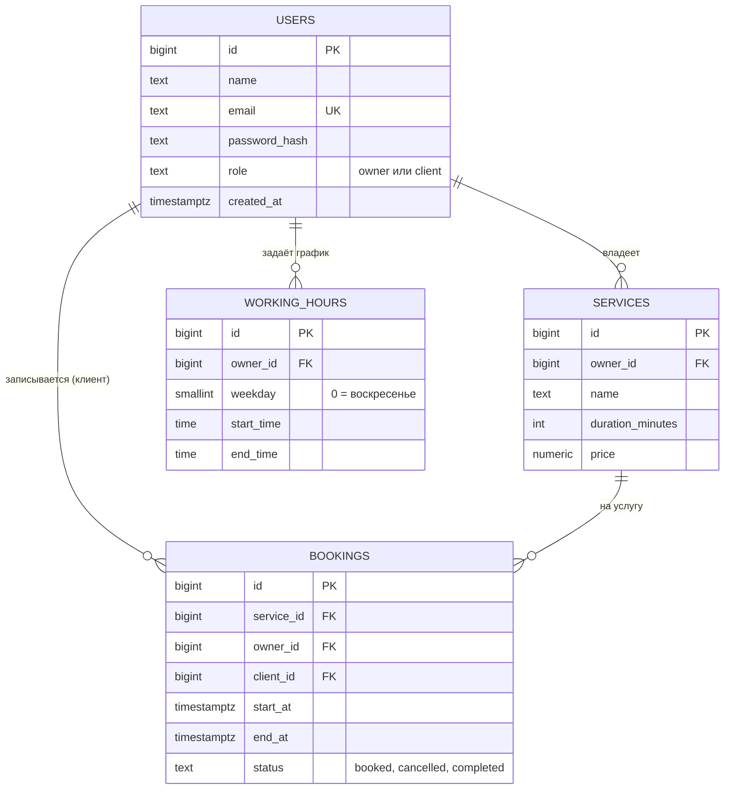
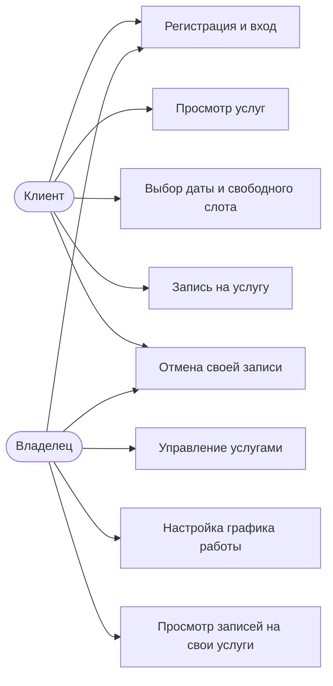
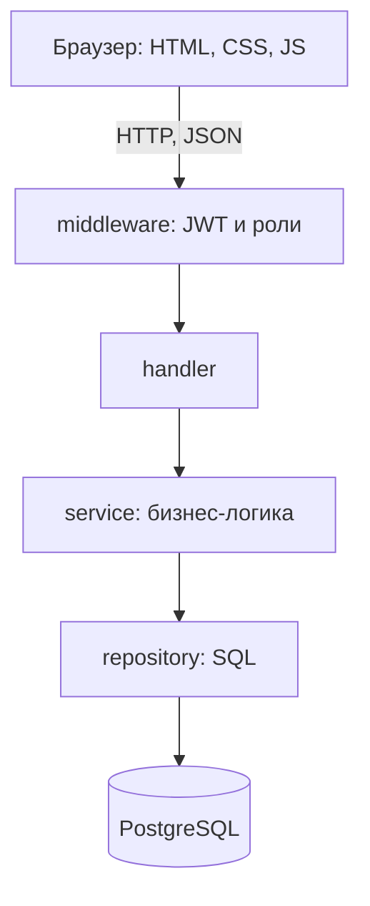
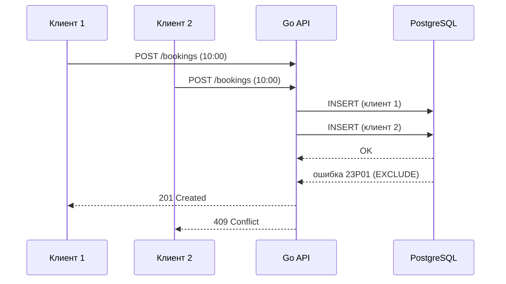

# Диаграммы проекта

## ER-диаграмма базы данных

```mermaid
erDiagram
    USERS ||--o{ SERVICES : "владеет"
    USERS ||--o{ WORKING_HOURS : "задаёт график"
    USERS ||--o{ BOOKINGS : "записывается (клиент)"
    SERVICES ||--o{ BOOKINGS : "на услугу"

    USERS {
        bigint id PK
        text name
        text email UK
        text password_hash
        text role "owner или client"
        timestamptz created_at
    }
    SERVICES {
        bigint id PK
        bigint owner_id FK
        text name
        int duration_minutes
        numeric price
    }
    WORKING_HOURS {
        bigint id PK
        bigint owner_id FK
        smallint weekday "0 = воскресенье"
        time start_time
        time end_time
    }
    BOOKINGS {
        bigint id PK
        bigint service_id FK
        bigint owner_id FK
        bigint client_id FK
        timestamptz start_at
        timestamptz end_at
        text status "booked, cancelled, completed"
    }
```

## Варианты использования

```mermaid
flowchart LR
    C([Клиент])
    O([Владелец])

    C --> A1[Регистрация и вход]
    C --> A2[Просмотр услуг]
    C --> A3[Выбор даты и свободного слота]
    C --> A4[Запись на услугу]
    C --> A5[Отмена своей записи]

    O --> A1
    O --> B1[Управление услугами]
    O --> B2[Настройка графика работы]
    O --> B3[Просмотр записей на свои услуги]
    O --> A5
```

## Архитектура

```mermaid
flowchart TB
    Browser[Браузер: HTML, CSS, JS] -->|HTTP, JSON| MW[middleware: JWT и роли]
    MW --> H[handler]
    H --> S[service: бизнес-логика]
    S --> R[repository: SQL]
    R --> DB[(PostgreSQL)]
```

## Одновременная запись на один слот

```mermaid
sequenceDiagram
    participant C1 as Клиент 1
    participant C2 as Клиент 2
    participant API as Go API
    participant DB as PostgreSQL

    C1->>API: POST /bookings (10:00)
    C2->>API: POST /bookings (10:00)
    API->>DB: INSERT (клиент 1)
    API->>DB: INSERT (клиент 2)
    DB-->>API: OK
    DB-->>API: ошибка 23P01 (EXCLUDE)
    API-->>C1: 201 Created
    API-->>C2: 409 Conflict
```